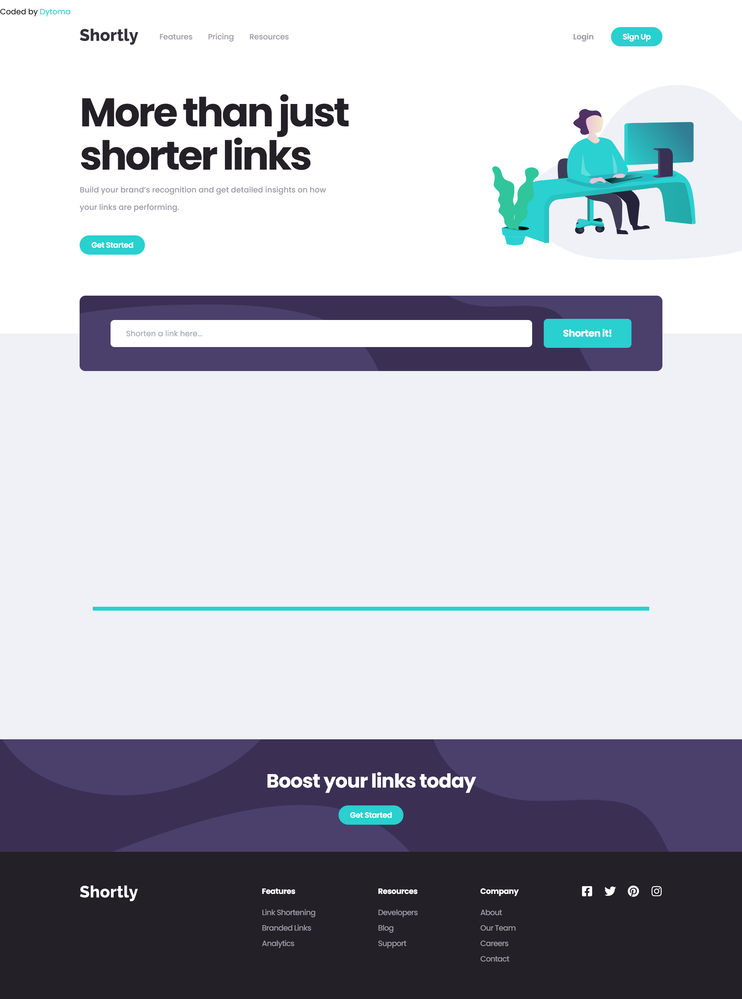

# Frontend Mentor - Shortly URL shortening API Challenge solution

This is a solution to the [Shortly URL shortening API Challenge challenge on Frontend Mentor](https://www.frontendmentor.io/challenges/url-shortening-api-landing-page-2ce3ob-G). Frontend Mentor challenges help you improve your coding skills by building realistic projects. 

## Table of contents

- [Overview](#overview)
  - [The challenge](#the-challenge)
  - [Screenshot](#screenshot)
  - [Dependencies](#dependencies)
  - [Links](#links)
- [My process](#my-process)
  - [Built with](#built-with)
  - [Continued development](#continued-development)
- [Author](#author)


## Overview

This website have for purpose to shorten all your links and have some amazing features like copying the links shortened to you clipboard that can boost your productivity. At the moment, the api isn't working and this is a server side error. Probably the issue will be settled and you can use the shortening feature. You can however view the site with it's amazing animations.

### The challenge

Users should be able to:

- View the optimal layout for the site depending on their device's screen size
- Shorten any valid URL
- See a list of their shortened links, even after refreshing the browser
- Copy the shortened link to their clipboard in a single click
- Receive an error message when the `form` is submitted if:
  - The `input` field is empty

### Screenshot



This is a screenshot of the whole page, some content aren't visible because of the animations. Apart this site is complete, mobile and desktop responsive. 

### Dependencies
- Axios
- Tailwind CSS
- Framer Motion
- React icons
- React and react-dom come with the ```create-react-app```

You can run `npm install` on your terminal to install all dependencies on your local machine

### Links

- Solution URL: [Solution URL here](https://www.frontendmentor.io/solutions/url-shortening-app-o3NKPZ3vV9)
- Live Site URL: [Live site URL here](https://url-shortening-app8.netlify.app/)


### Built with

- Semantic HTML5 markup
- Flexbox
- CSS Grid
- Mobile-first workflow
- [React](https://reactjs.org/) - JS library
- [Tailwind CSS](https://tailwindcss.com/) - For styles
- [Framer Motion](https://www.framer.com/motion/) - For animations
- [Axios](https://axios-http.com/docs/intro) - For fetching data


### Continued development

For my next project I would like to work on dark/light mode, know how it works and implement this amazing feature to some of the apps I'll have to code.


## Author

- Frontend Mentor - [@Dytoma](https://www.frontendmentor.io/profile/Dytoma)
- Twitter - [@OmarDytoma](https://www.twitter.com/OmarDytoma)


# React app
# Getting Started with Create React App

This project was bootstrapped with [Create React App](https://github.com/facebook/create-react-app).

## Available Scripts

In the project directory, you can run:

### `npm start`

Runs the app in the development mode.\
Open [http://localhost:3000](http://localhost:3000) to view it in your browser.

The page will reload when you make changes.\
You may also see any lint errors in the console.

### `npm test`

Launches the test runner in the interactive watch mode.\
See the section about [running tests](https://facebook.github.io/create-react-app/docs/running-tests) for more information.

### `npm run build`

Builds the app for production to the `build` folder.\
It correctly bundles React in production mode and optimizes the build for the best performance.

The build is minified and the filenames include the hashes.\
Your app is ready to be deployed!

See the section about [deployment](https://facebook.github.io/create-react-app/docs/deployment) for more information.

